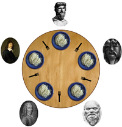

# Jantar dos Filósofos  
## Problema:  
Considere 5 filósofos que passam a vida a pensar e a comer. Partilham uma mesa redonda rodeada por 5 cadeiras sendo que cada uma das cadeiras pertence a um filósofo. No centro da mesa encontra-se uma travessa de macarrão e estão 5 garfos na mesa, um para cada filósofo.

Quando um filósofo pensa não interage com os seus colegas. De tempos em tempos, cada filósofo fica com fome e tenta apanhar os dois garfos que estão mais próximos (os garfos que estão ou à esquerda ou à direita). O filósofo apenas pode apanhar um garfo de cada vez e como o leitor compreende, não pode apanhar um garfo se este estiver na mão do vizinho. Quando um filósofo esfomeado tiver 2 garfos ao mesmo tempo ele come sem largar os garfos. Apenas quando acaba de comer, o filósofo pousa os garfos, libertando-os e começa a pensar de novo 

## Solução :
Para evitar que os filósofos morram de fome pensando demais, devemos criar um algoritmo  
usando thread e semaforos, para dar a chance de cada filósofo, pegar os 2 garfos para que assim consiga comer seu macarrão.

